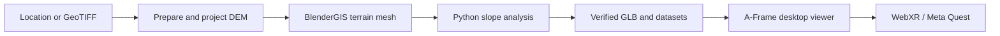

# VR 3D Terrain Analysis

A local terrain-intelligence pipeline that turns real-world elevation data into an interactive 3D and WebXR experience.

Choose a location, build a georeferenced terrain through BlenderGIS, inspect elevation and slope in the browser, and explore the same model on a WebXR headset such as Meta Quest.

## Features

- Search for a place, enter coordinates, use device location, or import a survey/LiDAR GeoTIFF.
- Build an exact square area from **0.5 km to 10 km** wide.
- Use Copernicus GLO-30 globally or USGS 3DEP in the continental United States.
- Display aerial/satellite imagery, slope classes, or elevation colours.
- Select two terrain points to inspect coordinates, elevation, slope, rise/drop and distance.
- Explore a fitted overview or a full **1:1 scale** model without vertical exaggeration.
- Fly and teleport in WebXR using Meta Quest controllers.
- Download the processed DEM, sample CSVs, slope CSV, statistics and verification report.
- Keep the last verified terrain available if a new build fails.

## Pipeline



The application is local-first. Python prepares the source data, BlenderGIS creates the terrain, Blender calculates slope classes, and a dependency-free Node server publishes the verified result to the browser.

## Requirements

- Windows 10 or 11
- [Node.js](https://nodejs.org/) 18 or newer
- Python 3.10 or newer
- [Blender](https://www.blender.org/) installed through Steam or directly
- [BlenderGIS](https://github.com/domlysz/BlenderGIS) installed and enabled in Blender
- Internet access when downloading Copernicus, USGS or Esri data
- A WebXR-compatible browser and headset for immersive mode

Install BlenderGIS from its release ZIP through Blender's add-on preferences and
enable it before the first terrain build.

The default Blender executable is:

```text
D:\SteamLibrary\steamapps\common\Blender\blender.exe
```

If Blender is installed elsewhere, set `BLENDER_EXE` before launching the chooser:

```powershell
$env:BLENDER_EXE = "C:\path\to\blender.exe"
```

## Installation

Clone the repository and enter the project folder:

```powershell
git clone <your-repository-url>
cd Vr3dProject
```

Create the Python environment and install the processing dependencies:

```powershell
python -m venv .venv
.venv\Scripts\python.exe -m pip install -r requirements.txt
```

The project pins Rasterio 1.5.1, PyProj 3.8.0 and Pillow 12.3.0. A-Frame and Proj4 are included in `webxr/js`, so the viewer does not need an npm install.

## Quick start

Double-click:

```text
choose-terrain.cmd
```

The launcher starts the local server and opens the terrain chooser. Search for a location, choose the area and data source, then select **Build terrain**. The browser displays progress while Python and Blender process and verify the result.

To reopen the current terrain without rebuilding it, run:

```powershell
powershell -ExecutionPolicy Bypass -File .\start.ps1
```

Then open:

- Viewer: <http://localhost:8080>
- Terrain chooser: <http://localhost:8080/choose.html>
- Data and accuracy guide: <http://localhost:8080/guide.html>

Blender runs in the background during a build; it does not need to be opened manually.

## Using your own survey or LiDAR data

Choose **My survey / LiDAR GeoTIFF** in the terrain chooser and provide a georeferenced elevation TIFF that:

- covers the selected area;
- contains a valid coordinate reference system;
- stores horizontal and vertical measurements in metres; and
- has a known vertical datum.

The pipeline reprojects and samples the source for the requested extent. Large areas are limited to roughly 500 cells per side to keep the model practical for VR. Always validate operational work against independent ground control.

## Understanding accuracy

Image sharpness and elevation accuracy are different things. The aerial image controls appearance; the DEM controls terrain height and slope.

Copernicus GLO-30 is a digital surface model with approximately 30 m sample spacing. It may include buildings and vegetation and cannot resolve every trail, ditch, structure or recent terrain change. Its published global accuracy specification is not proof of accuracy at a particular site.

USGS 3DEP can provide finer data in supported parts of the United States. A properly surveyed local GeoTIFF is the preferred source for detailed site analysis.

This application provides analytical estimates. It does not certify route safety, construction suitability or survey-grade position/elevation accuracy.

## Slope classification

Slope is calculated from the triangulated terrain surface against geographic up. The default classes are:

| Colour | Slope |
| --- | ---: |
| Blue | 0–10° |
| Green | >10–25° |
| Yellow | >25–35° |
| Orange | >35–45° |
| Red | >45° |

Thresholds can be changed in `blender/terrain_analysis.py`. Reported averages are weighted by triangle surface area.

## Build lifecycle

1. `tools/prepare_data.py` obtains the required DEM window, projects it to a metric UTM grid, records provenance and obtains matching imagery.
2. `blender/import_prepared.py` uses BlenderGIS `DEM_RAW` import to create the terrain mesh.
3. `blender/terrain_analysis.py` triangulates evaluated geometry, calculates slope, assigns materials and exports GLB, CSV and statistics files.
4. `tests/verify_glb.py` and `tests/verify_accuracy.py` validate slope classes, geometry heights, projected bounds and imagery UV coordinates.
5. `tools/build_terrain.py` publishes an immutable build and updates `webxr/assets/current.json` only after verification succeeds.

Intermediate and previous builds are retained locally under `builds/`. These generated folders are ignored by Git.

## Controls

### Desktop

- Drag: look around
- `W`, `A`, `S`, `D`: fly
- `Q` / `E`: descend / ascend
- Click terrain: inspect a point
- **Fit overview**: show the complete model
- **Explore · 1:1**: use real metre scale

### Meta Quest / WebXR

- Left stick: move
- Right stick up/down: descend/ascend
- Right stick left/right: 30° snap turn
- Right trigger: teleport to a surface no steeper than 45°

WebXR requires a secure context. `localhost` works on the PC. For a headset, use trusted HTTPS or authorized USB/ADB localhost forwarding. The helper scripts in `tools/` can configure local HTTPS and a narrowly scoped Windows firewall rule, but certificate trust and headset connectivity depend on the local environment.

## Testing

Run the data-quality tests with the project Python environment:

```powershell
.venv\Scripts\python.exe -m unittest tests.test_data_quality
```

Run Blender slope tests, replacing the executable path when needed:

```powershell
& "D:\SteamLibrary\steamapps\common\Blender\blender.exe" --background --python tests/test_slopes.py
```

Create the ignored, development-only JavaScript test environment and run the
viewer integration test:

```powershell
npm install --prefix .test-runtime jsdom@26.1.0 three@npm:super-three@0.173.4
node tests/test_viewer.cjs
```

Every normal terrain build also runs the GLB and accuracy verification stages before publishing. Automated DOM tests do not replace testing on a real GPU or headset.

## Project structure

```text
blender/                 Blender import and slope-analysis scripts
data/                    Active terrain choice and prepared source data
tests/                   Geometry, data-quality and viewer verification
tools/                   Build, data preparation, HTTPS and LAN helpers
webxr/                   A-Frame viewer and downloadable verified assets
build.ps1                Build from data/terrain-choice.json
choose-terrain.cmd       Recommended Windows launcher
server.cjs               Local static server and build/search endpoints
start.ps1                Open the existing verified terrain
```

The server exposes only `webxr/` as static content. Terrain build and place-search requests are restricted to the local PC; other devices may view already-published terrain.

## Data sources and attribution

- [Copernicus DEM on AWS](https://registry.opendata.aws/copernicus-dem/)
- [Copernicus DEM product information](https://dataspace.copernicus.eu/explore-data/data-collections/copernicus-contributing-missions/collections-description/COP-DEM)
- [USGS 3DEP Elevation](https://elevation.nationalmap.gov/arcgis/rest/services/3DEPElevation/ImageServer)
- [Esri World Imagery](https://services.arcgisonline.com/ArcGIS/rest/services/World_Imagery/MapServer)
- [BlenderGIS](https://github.com/domlysz/BlenderGIS)

Source-specific attribution and provenance are stored with each build and displayed in the viewer. Review the terms of every dataset before redistribution or commercial use.

## Current limitations

- The build pipeline and launch helpers target Windows.
- Global automatic terrain is generally limited by the source DEM resolution.
- Aerial imagery dates and resolution may vary across one terrain extent.
- Missing source samples stop a build instead of inventing elevation values.
- Quest controller support is implemented, but each headset/browser/network setup should be tested independently.

## License

No project source-code license has been selected yet. Add a `LICENSE` file before presenting the repository as open source. Third-party software and geographic datasets retain their respective licences and terms.
